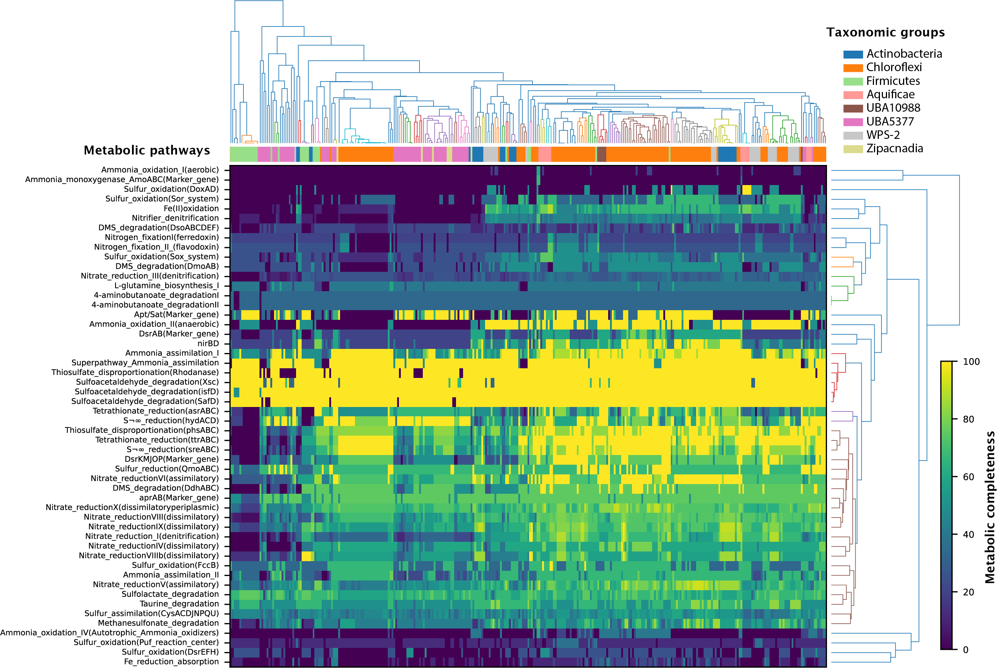

# New globally distributed lineages of Aratimonadetes bacteria capable of acetogenesis

Repository that contain the main data and scripts to compute the supplementary figure from:

Carlton et al., 

Last updated: July 2022


## Metabolic relateness

Steps to compute [MEBS](https://github.com/valdeanda/mebs) scores in 77 MAGs + references described in the study contained in the <zipacna genomes faa> folder. 
  
1. Compute scores and metabolic completeness (Supplementary Table X)   

```
perl mebs.pl -input <zipacna genomes faa> -type genomic -comp > zipacna.tsv 
```

 2. Normalize scores, generate figures and generate MEBS file to cluster
 
This script will generate a directory named zipacna.tsv_vis_out/ 
  
```
python3 mebs_vis.py zipacna.tsv  
```

 3. Generate the clustering visualization with the file containing the normalized scores of a data set of 2,107 non redundant genomes internaly storage in MEBS + scores of the genomes described in this study + references found in Supplementary Table 2  
  
```
python3 F_MEBS_cluster.py  --all  zipacna.tsv_vis_out/zipacna.tsv_2_cluster_mebs.tsv

```
 
  
4.
  

`Metabolic heatmap`

Using the script from the [Useful scripts github repo](https://github.com/valdeanda/Useful_scripts/blob/master/README.md#heatmap) written by [Dr. Cesar Poot](https://scholar.google.com.mx/citations?user=dwpBCCQAAAAJ&hl=en). 


```
python3 heatmap.py  -f pdf data_heatmapZipacna.tsv
```



---
